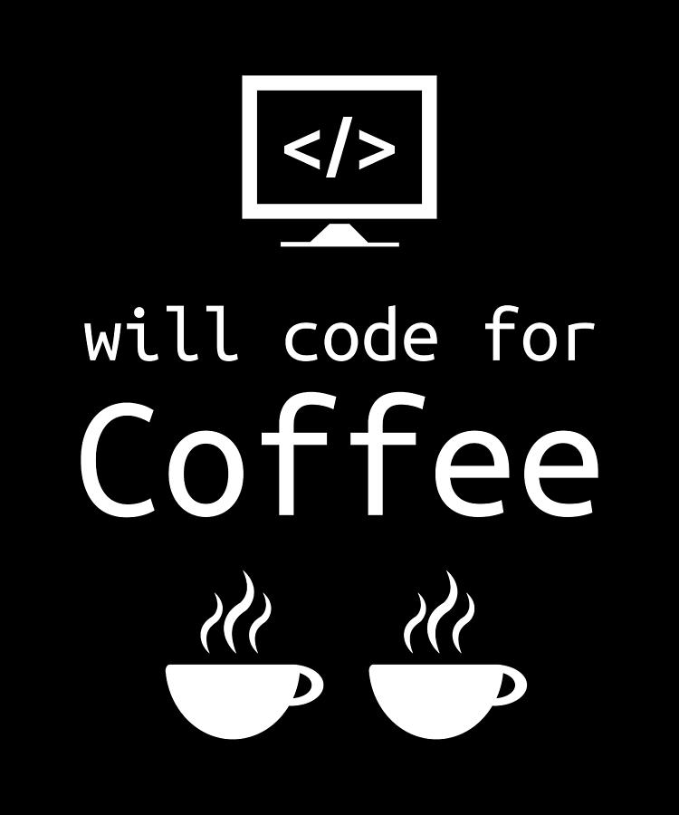
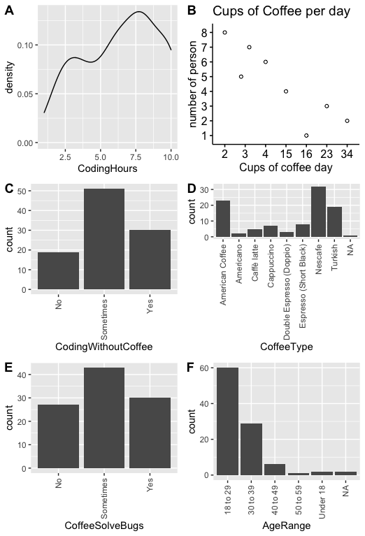

# bios611-project

This is 2022-BIOS611 course project repository.

### Coffee and Coding

Having a cup of coffee is something I enjoy every day, and I believe it is typical for an average graduate student and almost a life source. Coffee helps wake you up in the morning and can be used as a pill for concentration or to get some coffee while you are spending time with people during break hours or leisure. What about people who do coding? Many graduate students drink coffee while coding because coffee contains caffeine and keeps your brain from getting tiresome. Here, the coffee and code dataset from Kaggle has nine columns, including coding hours, coffee cups per day, coffee time, coding without coffee, coffee type, solving bugs, country, age range, and gender. <br />

### Datasets

I found the datasets from Kaggle, and it is the "caffeine content of drinks" and "Coffee and code dataset"

Coffee and code Dataset (<https://www.kaggle.com/datasets/shrutikunapuli/coffee-and-code-dataset>)

-   Coding Hours

-   Coffee cups per day

-   Coffee Time

-   Coding without coffee

-   Coffee Type

-   Coffee solves Bugs

-   Gender

-   Country

-   Age range

{width="270"}

### Preliminary Figures

Summary of columns except coffeetime, gender and country

\*Coffeetime shows everyone drinks, Gender is not big affect of coding and there is only one country (Lebanon)



### Usage

You will need Docker and the ability to run Docker as your current user.

To build the container:

```{bash}

 docker build . -t project-env
```

To run the Rstudio server in the container:

```{bash}
docker run -v 'pwd':/home/rstudio -p 8787:8787 -e PASSWORD=pwd -t project-env

```

Then connect to the machine on port 8787

### Makefile

The Makefile included in this repository will build the major components of the project. For example, to build the report associated with this repository, in the Terminal of the Docker Rstudio instance enter:

```{r}
make report.pdf

```

To make every element in the repository, run:

```{r}
make all

```

### R Shiny App

To interactively look at the distribution of coffee vs coding in each category, use the R shiny App as follows:

```{bash}
docker run -v 'pwd':/home/rstudio -p 8080:8080 -p 8787:8787 \
  -e PASSWORD=mypassword -t project-env

```

Then within Rsutdio, launch from the Terminal:

```{bash}
PORT=8080 make shiny_app

```

The app is then available on your browser at port 8080
