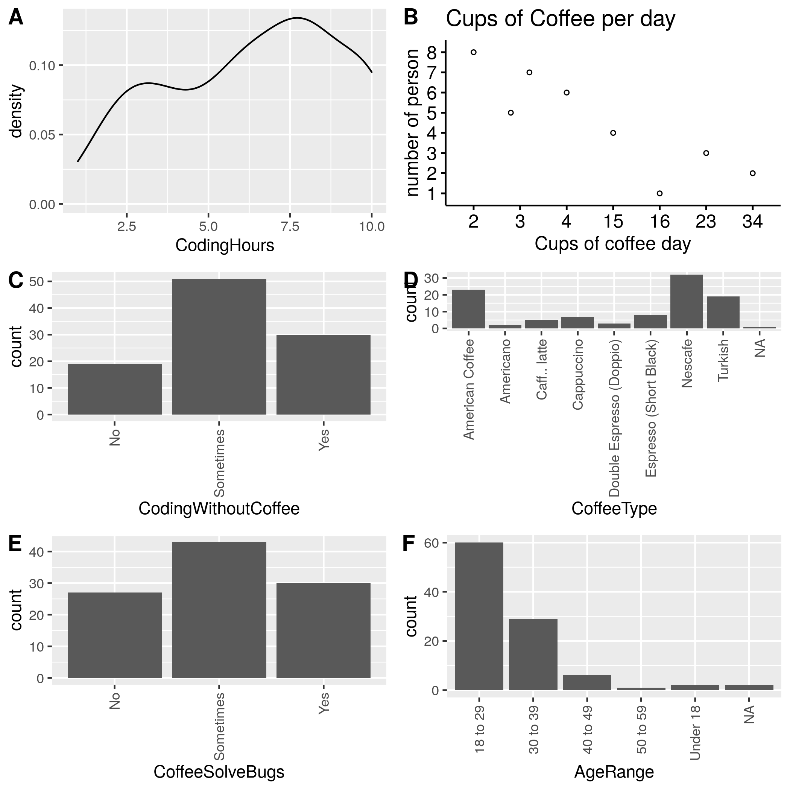

```{r setup, include=FALSE}
knitr::opts_chunk$set(echo = TRUE)
```

### Coffee and Coding

Having a cup of coffee is something I enjoy every day, and I believe it is typical for an average graduate student and almost a life source. Coffee helps wake you up in the morning and can be used as a pill for concentration or to get some coffee while you are spending time with people during break hours or leisure. What about people who do coding? Many graduate students drink coffee while coding because coffee contains caffeine and keeps your brain from getting tiresome. Here, the coffee and code dataset from Kaggle has nine columns, including coding hours, coffee cups per day, coffee time, coding without coffee, coffee type, solving bugs, country, age range, and gender.

# Datasets

I found the datasets from Kaggle, and it is the "caffeine content of drinks" and "Coffee and code dataset"

Coffee and code Dataset (<https://www.kaggle.com/datasets/shrutikunapuli/coffee-and-code-dataset>)

# Results

According to the summary of the data columns, which factors would be more relevant to study the coding and coffee relationship



<center>

Figure1 explore data set

</center>

The most important columns of summary

```{r}
cc <- as.data.frame(read.csv("./01.source/coffeeandcode2018.csv",sep=",",header=T))
summary(cc)[,1:2]
```

```{r}
#This data set is from only one country selected but you can choose any category to look at it...
table(cc$Country)
```

First, this data comes from 100 Lebanese data. Therefore, we would not consider the country from this data. Second, the Coding mean hour is 6.41 median hour is 7 hours. Third, a cup of coffee tends to decrease daily, and many people drink 2 cups of coffee (34%), which was one-third of this data set. Now, there are the majority of people answered coding without coffee "sometime." I interpreted this as "No" because people still drank coffee and did further analysis. Fourth, eight coffee-type people were drinking, and Nescafe was the 32 people, about one-third of whom were drinking. Fifth, in the coffee, solved bugs section, people answered: "some time" for 43 people, and I interpreted it as "Yes" for further analysis. Lastly, the majority age group was 18-19 (n=60).

I have done numeric value correlations between coding hours vs. coffee cups per day, coding hours vs. coding without coffee, and coding hours vs. solve bugs.


<center>

Figure2 Correlation between coding hours and coffee cups per day

</center>

This graph shows the relationship between coding hours and coffee cups per day. The correlation is 0.314, which reveals that coding hours and coffee cups per day have a positive correlation but are not strong.


<center>

Figure3 Correlation between coding hours and coding without coffee

</center>

This graph shows the negative correlation between coding hours and coding without coffee. People tend to have coffee while they do the coding.


<center>

Figure4 Correlation between coding hours and solve bugs

</center>

This graph shows the negative correlation between coding hours and solving bugs. Solving bugs is not correlate with how much time do coding. (I thought this is fun fact)


<center>

Figure5 Correlation between coffee solve bugs, coding without coffee, and coffee cups per day

</center>


<center>

Figure6 PCA plot-colored gender

</center>


<center>

Figure7 PCA plot-colored coffee time

</center>

PCA plot is generated with the first two columns (coding hours and coffee cups per day), then choose PC1 and PC2. After that, color samples with Gender and coffee time. However, there is no sign of grouping.

# Conclusions

In this study, we used the "Coffee and code dataset." Here, I did not find any strong correlation between coffee and coding. However, the dataset's limitation is that it is only 100 rows selected from one country. It is hard to know how this is collected. It is hard to know what kind of coding the person was working on. It is hard to see the caffeine consumption in one cup of coffee---the answers with the "sometimes" meaning. Lastly, coding hours are per day or week. The dataset was not straightforward. Therefore, we need to increase the sample size and eliminate all the limitations. Then, it could give us better insight relationship between coffee and coding.
